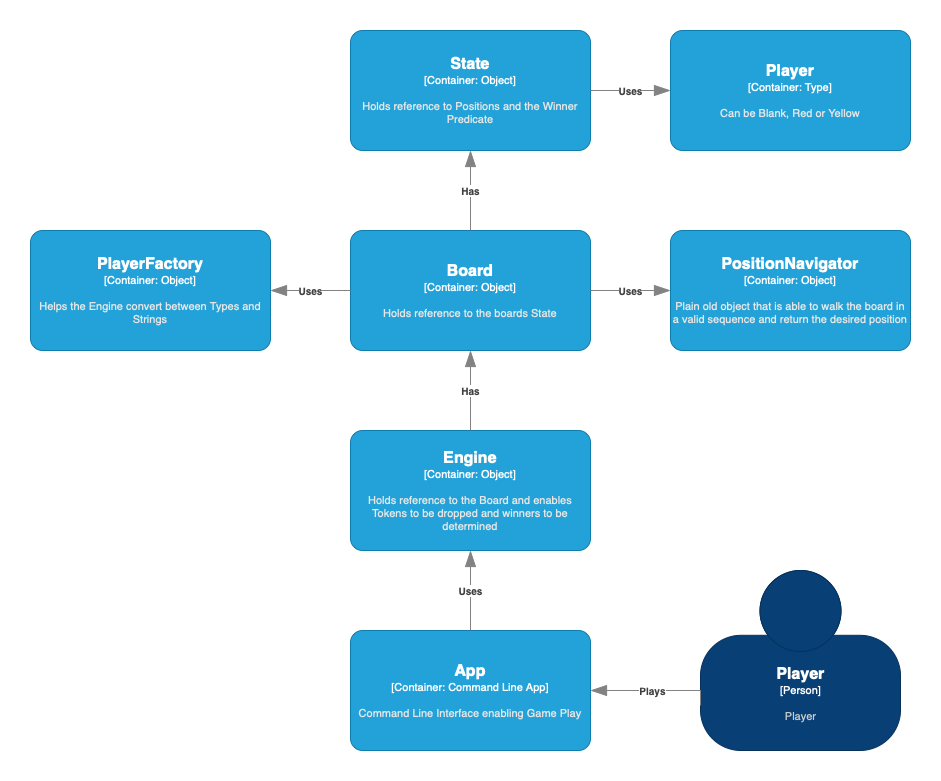

# cc-connect-four
AND Digital - Connect Four coding challenge

## Setup Engine:

```shell
brew install deno
```

## Run tests

```shell
deno test EngineTest.ts
```

## Run engine against sample input

```shell
deno run SameplSetOfMoves.ts
```

## Play interactively with the computer

```shell
deno run --allow-env app.ts
``` 

## Architecture

